Load Packages


```r
library(tidyverse)
library(lubridate)
library(tidyverse)
library(stringr)
library(tidyr)
# Set chunk options
knitr::opts_chunk$set(warning=FALSE, message=FALSE)
```

Import and Bind Voter Data 


```r
#vote_particip <- read_csv("http://bit.ly/2kG37yJ")
vote_motor <- read_csv("http://bit.ly/2lCadlB")


#These are the files with correct voting turnout data, however they are still missing registration type, which I join from the data used in Home Work 1. 
#file.choose()
voter1 <- read_tsv("/Users/rosa/Desktop/or_voter_history/CD1_VoterHistory_Jan2017.txt")
voter2 <- read_tsv("/Users/rosa/Desktop/or_voter_history/CD2_VoterHistory_Jan2017.txt")
voter3 <- read_tsv("/Users/rosa/Desktop/or_voter_history/CD3_VoterHistory_Jan2017.txt")
voter4 <- read_tsv("/Users/rosa/Desktop/or_voter_history/CD4_VoterHistory_Jan2017.txt")
voter5 <- read_tsv("/Users/rosa/Desktop/or_voter_history/CD5_VoterHistory_Jan2017.txt")

voter_all <- rbind(voter1, voter2, voter3, voter4, voter5)


# Add Registration Type 
  
voter_all2 <- left_join(x = voter_all,y = vote_motor, by = "VOTER_ID")
```

Tidy Vote File 


```r
voter_or <- voter_all2 %>%
  select(VOTER_ID, FIRST_NAME, LAST_NAME, COUNTY.x, CITY, BIRTH_DATE, STATUS, PARTY_CODE, PRECINCT_NAME, PRECINCT, ZIP_CODE, `11/08/2016`, DESCRIPTION, `11/06/2012`, `11/04/2008`)
```

Import Geographic Data


```r
#I first import Census tract data, then State Legislative district, then County. I finally import Zip Code which I use for this project. However, while the others are from the 2015 community report, the Zip Code data comes from the 2010 election, so there is not perfect demographic information. 
#file.choose()
#census <- read_csv("/Users/rosa/Desktop/SEcensus.csv")

#file.choose()
#stateleg <- read_csv("/Users/rosa/Desktop/SEstateleg.csv")

#file.choose()
#county <- read_csv("/Users/rosa/Desktop/SEcounty.csv")

#file.choose()
zipcode <- read_csv("/Users/rosa/Desktop/zipcode.csv")
```

Tidy Geographic Data 


```r
zipcode <- zipcode %>%
  mutate(Geo_NAME = str_replace_all(Geo_NAME, pattern = "ZCTA5 ", replacement = ""))

# Make note of which zips have "(part)" - For later
part_zips <- zipcode %>%
  filter(grepl("part", Geo_NAME))

# Clear those out
zipcode <- zipcode %>%
    mutate(Geo_NAME = substr(Geo_NAME, 1, 5)) %>%
  rename(total_pop = SE_T003_001,
         male = SE_T003_002,
         female = SE_T003_003,
         total_pop2 = SE_T054_001,
         white = SE_T054_002,
         black = SE_T054_003, 
         ai = SE_T054_004,
         asian = SE_T054_005,
         hawaiian = SE_T054_006,
         other = SE_T054_007, 
         two = SE_T054_008,
         ZIP_CODE = Geo_NAME) 

         
# Just Sex
sex <- zipcode %>%
  select(ZIP_CODE, total_pop, male, female)

# Just Race

zipcode$p_black <- zipcode$black / zipcode$total_pop
zipcode$p_white <- zipcode$white / zipcode$total_pop

race <- zipcode %>%
  select(ZIP_CODE, total_pop, white, black, ai, asian, hawaiian, other, two, p_black, p_white)
```

Get at zip code level for Oregon registered voters


```r
total_regs <- voter_or %>%
  group_by(ZIP_CODE) %>%
  summarize(count = n())
```

Construct Variables for Analysis: 

Proportion of registered that voted on Nov 2016 and Nov 2012 


```r
prop_voted2016 <- voter_or %>%
  group_by(ZIP_CODE) %>%
  summarize(prop_v16 = mean(`11/08/2016` == "YES"))

prop_voted2012 <- voter_or %>%
  group_by(ZIP_CODE) %>%
  summarize(prop_v12 = mean(`11/06/2012` == "YES"))
```

Proportion that are not Motor Voter Registered 


```r
a <- (is.na(voter_or$DESCRIPTION))
voter_or$DESCRIPTION[a] <- "conventional"
voter_or$DESCRIPTION <- as.factor(voter_or$DESCRIPTION)

table(voter_or$DESCRIPTION)
```

```
## 
## conventional  Motor Voter     MVPhase2 
##      2744872       151711       111645
```

```r
prop_regcon <- voter_or %>%
  group_by(ZIP_CODE) %>%
  summarize(prop_reg = mean(DESCRIPTION == "conventional"))

prop_regOMV <- voter_or %>%
  group_by(ZIP_CODE) %>%
  summarize(prop_OMV = mean(DESCRIPTION != "conventional"))
```

Construct data sets for analysis with Voter info by Zip Code including, number of registered voters, how they registered, and the proportion that voted.


```r
zipcode_data <- inner_join(x = total_regs,
                           y = prop_voted2016,
                           by = "ZIP_CODE")

zipcode_data <- inner_join(x = zipcode_data,
                           y = prop_voted2012,
                           by = "ZIP_CODE")

zipcode_data <- inner_join(x = zipcode_data,
                           y = prop_regOMV,
                           by = "ZIP_CODE")

# Join sex with voter reg aggregated data
sex_reg <- inner_join(x = sex, y = zipcode_data, 
                      by = "ZIP_CODE")

# Join race with voter reg aggregated data
race_reg <- inner_join(x = race, y = zipcode_data, 
                      by = "ZIP_CODE")
# One set with both 

zip_reg <- inner_join(x = race_reg, y = sex, 
                      by = "ZIP_CODE")

# Add Turnout difference 
require(dplyr)
require(tidyr)

zip_reg <- zip_reg %>%
mutate (vote_diff = prop_v16 / prop_v12)
```

Filter Outliers and Zips under 50 people 


```r
zip_reg <- filter(zip_reg, total_pop.x > 50)
zip_reg <- filter(zip_reg, p_white > .25)
```

Modeling: 

Model 1 and 2. Race and Registration


```r
# Model 1 and 2: Race and Registration Type 

# Model 1, Blackness 
 ggplot(zip_reg, aes(x = p_black, y = prop_OMV)) +
geom_point(color= "hotpink")+
  geom_smooth(method=`lm`, color= "mediumpurple2") +
    ggtitle("Registration Type by Zip Code Blackness") +
  labs(x="Percent Black of Zip Code",y="Proportion of Voters Registered Traditionally")
```

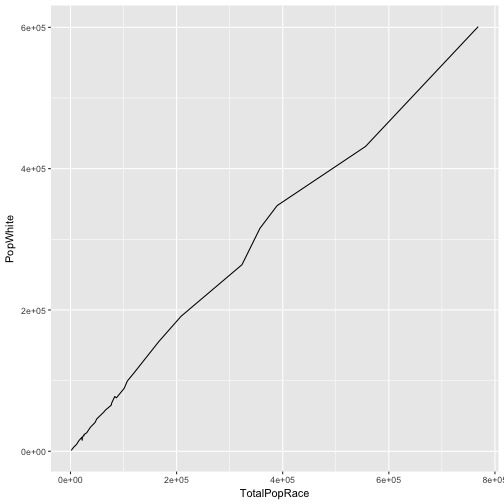

```r
m1 <- lm(p_black ~ prop_reg, data = zip_reg2)
```

```
## Error in is.data.frame(data): object 'zip_reg2' not found
```

```r
summary(m1)
```

```
## Error in summary(m1): object 'm1' not found
```

```r
# Log Transformation 
ggplot(zip_reg, aes(x = log(p_black +.005), y = prop_OMV)) +
geom_point(color= "mediumpurple2")+
  geom_smooth(method=`lm`, color= "hotpink") +
    ggtitle("Registration Type by Zip Code Blackness") +
  labs(x="Log Percet Black of Zip Code",y="Proportion of Voters Registered by OMV")
```

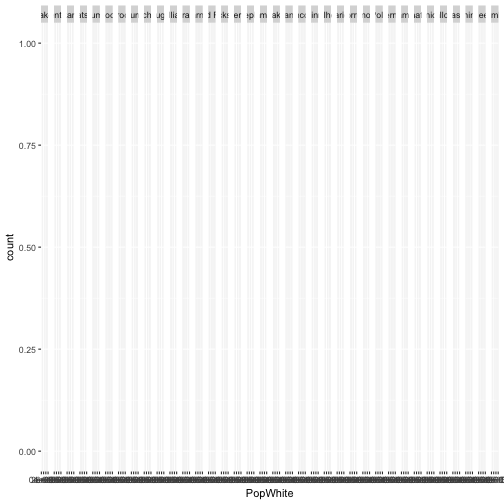

```r
#log both 
ggplot(zip_reg, aes(x = log(p_black), y = log(prop_OMV))) +
geom_point(color= "hotpink")+
  geom_smooth(method=`lm`, color= "mediumpurple2") +
    ggtitle("Registration Type by Zip Code Blackness") +
  labs(x="Log Percet Black of Zip Code",y="Log Proportion of Voters Registered Traditionally")
```

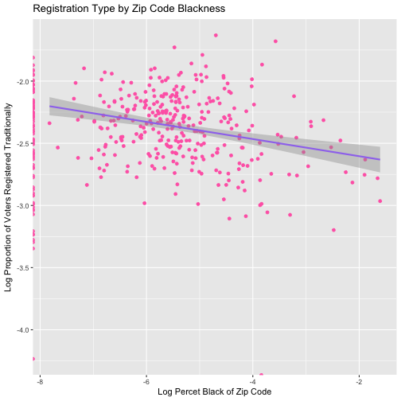

```r
#Alternative transformation

ggplot(zip_reg, aes(x = p_black +I(p_black^2), y = prop_OMV)) +
geom_point(color= "hotpink")+
  geom_smooth(method=`lm`, color= "mediumpurple2") +
    ggtitle("Registration Type by Zip Code Blackness") +
  labs(x="Log Percet Black of Zip Code",y="Proportion of Voters Registered Traditionally")
```

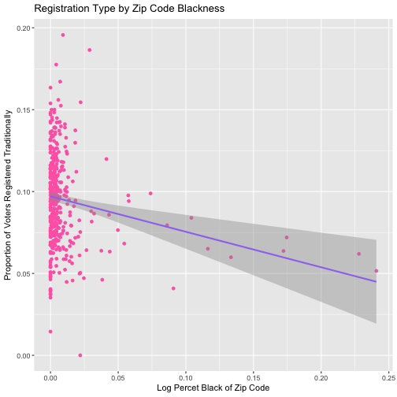

```r
# Linear Model 

m1b <- lm(log(p_black +.005) ~ prop_OMV, data = zip_reg)
summary(m1b)
```

```
## 
## Call:
## lm(formula = log(p_black + 0.005) ~ prop_OMV, data = zip_reg)
## 
## Residuals:
##     Min      1Q  Median      3Q     Max 
## -0.9602 -0.4564 -0.1170  0.2602  2.8995 
## 
## Coefficients:
##             Estimate Std. Error t value Pr(>|t|)    
## (Intercept)  -4.2821     0.1161 -36.873  < 2e-16 ***
## prop_OMV     -3.8683     1.1714  -3.302  0.00104 ** 
## ---
## Signif. codes:  0 '***' 0.001 '**' 0.01 '*' 0.05 '.' 0.1 ' ' 1
## 
## Residual standard error: 0.6583 on 403 degrees of freedom
## Multiple R-squared:  0.02635,	Adjusted R-squared:  0.02393 
## F-statistic:  10.9 on 1 and 403 DF,  p-value: 0.001045
```

```r
# -3.22 with p value of .004 

# Model 2  Whiteness 

 ggplot(zip_reg, aes(x = p_white, y = prop_OMV)) +
geom_point(color= "hotpink")+
  geom_smooth(method=`lm`, color= "mediumpurple2") +
    ggtitle("Registration Type by Zip Code Whiteness") +
  labs(x="Percet White of Zip Code",y="Proportion of Voters Registered Traditionally")
```

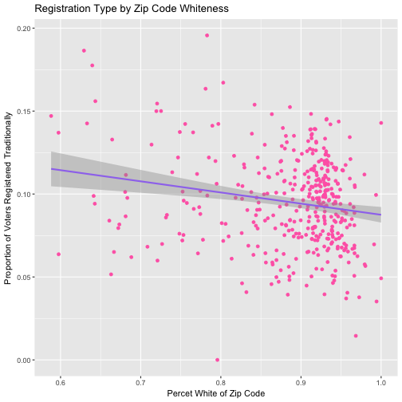

```r
#transformation
ggplot(zip_reg, aes(x = log(p_white), y = prop_OMV)) +
geom_point(color= "mediumpurple2")+
  geom_smooth(method=`lm`, color= "hotpink") +
    ggtitle("Registration Type by Zip Code Whiteness") +
  labs(x="Log Percent White of Zip Code",y="Proportion of Voters Registered by OMV")
```

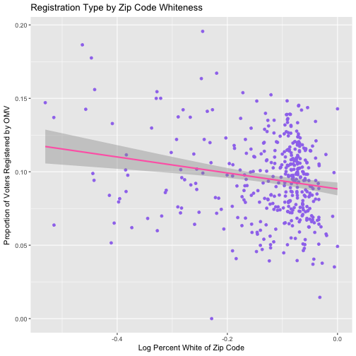

```r
#alternative transformaiton 
ggplot(zip_reg2, aes(x = p_white + I(p_white^2), y = prop_OMV +I(prop_reg^2))) +
geom_point(color= "hotpink")+
  geom_smooth(method=`lm`, color= "mediumpurple2") +
    ggtitle("Registration Type by Zip Code Whiteness") +
  labs(x="Percet White of Zip Code",y="Proportion of Voters Registered Traditionally")
```

```
## Error in ggplot(zip_reg2, aes(x = p_white + I(p_white^2), y = prop_OMV + : object 'zip_reg2' not found
```

```r
ggplot(zip_reg2, aes(x = p_white, y = log(prop_reg))) +
geom_point(color= "hotpink")+
  geom_smooth(method=`lm`, color= "mediumpurple2") +
    ggtitle("Registration Type by Zip Code Whiteness") +
  labs(x="Percet White of Zip Code",y="Log Proportion of Voters Registered Traditionally")
```

```
## Error in ggplot(zip_reg2, aes(x = p_white, y = log(prop_reg))): object 'zip_reg2' not found
```

```r
m2 <- lm(log(p_white) ~ prop_OMV, data = zip_reg)
summary(m2)
```

```
## 
## Call:
## lm(formula = log(p_white) ~ prop_OMV, data = zip_reg)
## 
## Residuals:
##      Min       1Q   Median       3Q      Max 
## -0.41043 -0.02704  0.03624  0.05998  0.15651 
## 
## Coefficients:
##             Estimate Std. Error t value Pr(>|t|)    
## (Intercept) -0.06242    0.01687   -3.70 0.000245 ***
## prop_OMV    -0.65858    0.17016   -3.87 0.000127 ***
## ---
## Signif. codes:  0 '***' 0.001 '**' 0.01 '*' 0.05 '.' 0.1 ' ' 1
## 
## Residual standard error: 0.09562 on 403 degrees of freedom
## Multiple R-squared:  0.03584,	Adjusted R-squared:  0.03345 
## F-statistic: 14.98 on 1 and 403 DF,  p-value: 0.0001267
```

```r
# -1.28 with P Value of  0.00 
```

Models Continued 


```r
# Model 3: Registration type and Voter turnout 
 ggplot(zip_reg, aes(x = prop_OMV, y = vote_diff)) +
geom_point(color= "hotpink")+
  geom_smooth(method=`lm`, color= "palegreen") +
    ggtitle("Voting Increase and Registration Type across Zip Code") +
  labs(x="Proportion of Voters Registered by OMV",y="Increase in Turnout for 2016 Election")+
   ylim(0, 3)
```

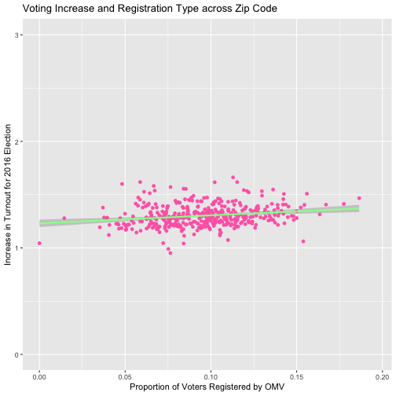

```r
#m3 <-lm vote_diff ~ prop_OMV, data = zip_reg)
#summary(m3)


# Model 4: Population and Registration Type 
 ggplot(zip_reg, aes(x = total_pop.x, y = prop_OMV)) +
geom_point(color= "hotpink")+
  geom_smooth(method=`lm`, color= "orange") +
    ggtitle("AVR Prevalance across ZipCode Populaiton") +
  labs(x="ZipCode Population ",y="Proportion of Voters Registered Automatically")
```

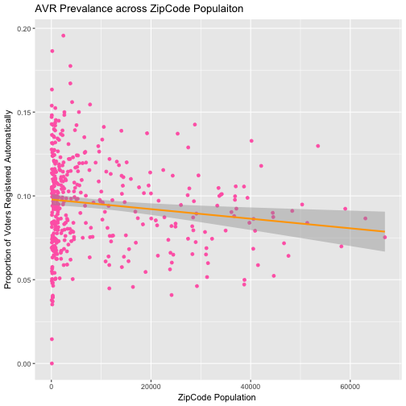

```r
m4 <-lm(total_pop.x ~ prop_OMV, data = zip_reg)
summary(m4)
```

```
## 
## Call:
## lm(formula = total_pop.x ~ prop_OMV, data = zip_reg)
## 
## Residuals:
##    Min     1Q Median     3Q    Max 
## -15625  -8591  -5969   3668  56202 
## 
## Coefficients:
##             Estimate Std. Error t value Pr(>|t|)    
## (Intercept)    15718       2348   6.694 7.29e-11 ***
## prop_OMV      -65946      23685  -2.784  0.00562 ** 
## ---
## Signif. codes:  0 '***' 0.001 '**' 0.01 '*' 0.05 '.' 0.1 ' ' 1
## 
## Residual standard error: 13310 on 403 degrees of freedom
## Multiple R-squared:  0.01887,	Adjusted R-squared:  0.01644 
## F-statistic: 7.752 on 1 and 403 DF,  p-value: 0.005617
```

```r
# -52383 P value = .017 

# Model 5: population and turnout rate
ggplot(zip_reg, aes(x = total_pop.x, y = vote_diff)) +
geom_point(color= "hotpink")+
  geom_smooth(method=`lm`, color= "yellowgreen") +
    ggtitle("Turnout Rates by ZipCode Populaiton") +
  labs(x="ZipCode Population ",y="Change in Turnout Rates from 2012 and 2016 Presidential Election")+
   ylim(0, 2)
```

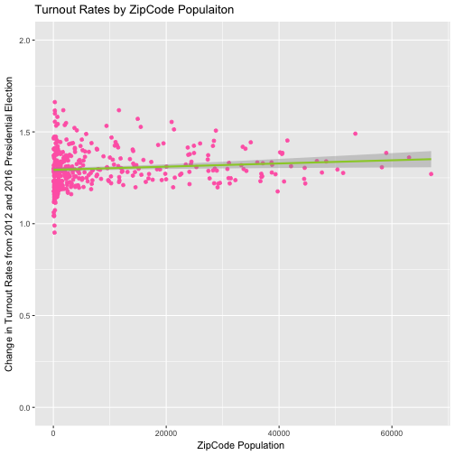

```r
#m5 <-lm(total_pop.x ~ vote_diff, data = zip_reg)
#summary(m5)

# Model 6 and 7: turnout by race 
ggplot(zip_reg, aes(x = log(p_white), y = vote_diff)) +
geom_point(color= "hotpink")+
  geom_smooth(method=`lm`, color= "skyblue1") +
    ggtitle("Turnout Rates by Zip code Whitness") +
  labs(x=" Log of Zip Code Whiteness ",y="Change in Turnout Rates from 2012 and 2016 Presidential Election")+
   ylim(0, 2)
```

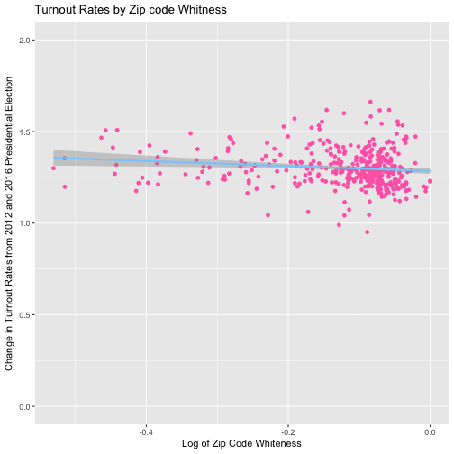

```r
ggplot(zip_reg, aes(x = log(p_black + .005), y = vote_diff)) +
geom_point(color= "hotpink")+
  geom_smooth(method=`lm`, color= "skyblue1") +
    ggtitle("Turnout Rates by Zip code Blackness") +
  labs(x="Log of Zip Code Blackness ",y="Change in Turnout Rates from 2012 and 2016 Presidential Election")+
   ylim(0, 2)
```

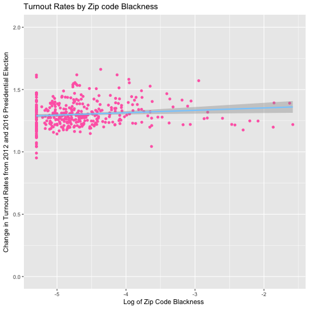

```r
m6 <- lm(vote_diff ~ p_white, data = zip_reg)
summary(m6)
```

```
## 
## Call:
## lm(formula = vote_diff ~ p_white, data = zip_reg)
## 
## Residuals:
##     Min      1Q  Median      3Q     Max 
##  -2.170  -0.454  -0.192  -0.055 139.609 
## 
## Coefficients:
##             Estimate Std. Error t value Pr(>|t|)  
## (Intercept)    6.929      3.914   1.770   0.0775 .
## p_white       -5.957      4.399  -1.354   0.1764  
## ---
## Signif. codes:  0 '***' 0.001 '**' 0.01 '*' 0.05 '.' 0.1 ' ' 1
## 
## Residual standard error: 6.979 on 403 degrees of freedom
## Multiple R-squared:  0.00453,	Adjusted R-squared:  0.00206 
## F-statistic: 1.834 on 1 and 403 DF,  p-value: 0.1764
```

```r
m7 <- lm(vote_diff ~ p_black, data = zip_reg)
summary(m7)
```

```
## 
## Call:
## lm(formula = vote_diff ~ p_black, data = zip_reg)
## 
## Residuals:
##     Min      1Q  Median      3Q     Max 
##  -0.693  -0.416  -0.358  -0.294 140.226 
## 
## Coefficients:
##             Estimate Std. Error t value Pr(>|t|)    
## (Intercept)   1.6444     0.3747   4.388 1.46e-05 ***
## p_black       0.4958    16.2919   0.030    0.976    
## ---
## Signif. codes:  0 '***' 0.001 '**' 0.01 '*' 0.05 '.' 0.1 ' ' 1
## 
## Residual standard error: 6.995 on 403 degrees of freedom
## Multiple R-squared:  2.298e-06,	Adjusted R-squared:  -0.002479 
## F-statistic: 0.0009261 on 1 and 403 DF,  p-value: 0.9757
```

More Plots 


```r
ggplot(zip_reg, aes(x = ZIP_CODE, y = p_white)) +
geom_point(color= "hotpink") +
    ggtitle("Whitness of Oregon Zip Codes") +
  labs(x="Zip Code",y="Percent White")
```

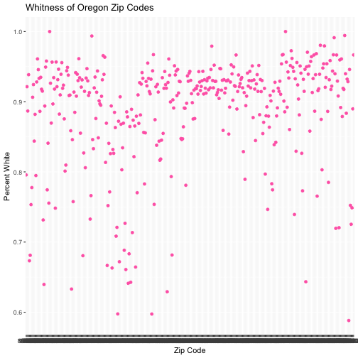

```r
 ggplot(zip_reg, aes(x = total_pop.x, y = prop_OMV)) +
geom_point(color= "hotpink")+
  geom_smooth(method=`lm`, color= "palegreen") +
    ggtitle("Registration Type across Zip Code Population") +
  labs(x="Zip Code Population",y="Proportion of Voters Registered by OMV")
```

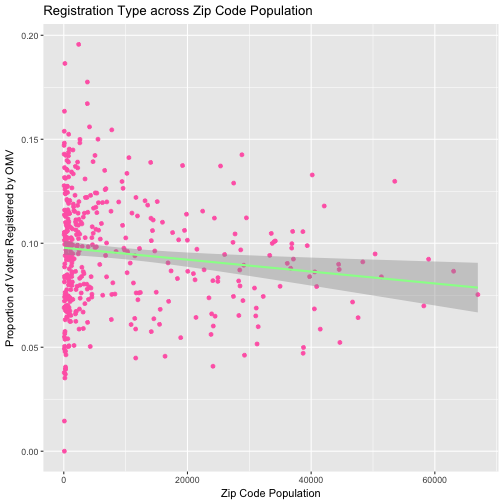

Extra Code 

```r
#race_reg2<- race_reg %>% 
  #gather(key="race", value = "number", 3:9)

#sex_reg2 <- sex_reg %>% 
 # gather(key="sex", value = "number", 3:4)

#both_regtidy <-inner_join(x = race_reg2, y = sex_reg2, 
                    #  by = "ZIP_CODE") 

#Dont need this any more, also does not work. 
#votor_or2 <- votor_or %>%
#  mutate(DESCRIPTION = stringr::str_replace_all(DESCRIPTION, NA, "Not Registered")
         
#MV <- voter_or2 %>%
  #group_by(ZIP_CODE) %>%
  #summarize(prop_MV = mean(DESCRIPTION != "conventional"))
  
  
      # prop_motorvoter <- voter_or %>%
 # group_by(ZIP_CODE) %>%
 # summarize(prop_NotMV = mean(`DESCRIPTION` == "Not Registered"))
```


