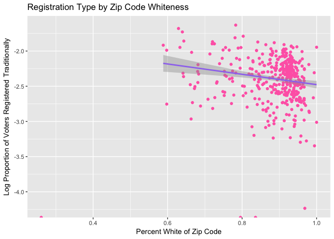
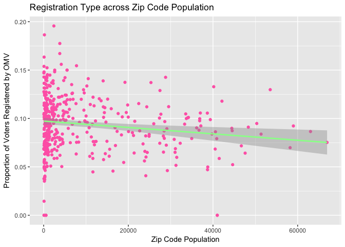

OMV file 1
================
RosaKalish

Load Packages

``` r
library(tidyverse)
library(lubridate)
library(stringr)
# Set chunk options
knitr::opts_chunk$set(warning=FALSE, message=FALSE)
```

Import and Bind Voter Data

``` r
#vote_particip <- read_csv("http://bit.ly/2kG37yJ")
vote_motor <- read_csv("http://bit.ly/2lCadlB")
```

``` r
#vote_particip <- read_csv("http://bit.ly/2kG37yJ")
vote_motor <- read_csv("http://bit.ly/2lCadlB")

#These are the files with correct voting turnout data, however they are still missing registration type, which I join from the data used in Home Work 1. 
#file.choose()
voter1 <- read_tsv("../data-raw/or_voter_history/CD1_VoterHistory_Jan2017.txt")
voter2 <- read_tsv("../data-raw/or_voter_history/CD2_VoterHistory_Jan2017.txt")
voter3 <- read_tsv("../data-raw/or_voter_history/CD3_VoterHistory_Jan2017.txt")
voter4 <- read_tsv("../data-raw/or_voter_history/CD4_VoterHistory_Jan2017.txt")
voter5 <- read_tsv("../data-raw/or_voter_history/CD5_VoterHistory_Jan2017.txt")

voter_all <- rbind(voter1, voter2, voter3, voter4, voter5)


# Add Registration Type 
  
voter_all2 <- left_join(x = voter_all,y = vote_motor, by = "VOTER_ID")
```

Tidy Vote File

``` r
voter_or <- voter_all2 %>%
  select(VOTER_ID, FIRST_NAME, LAST_NAME, COUNTY.x, CITY, BIRTH_DATE, STATUS, PARTY_CODE, PRECINCT_NAME, PRECINCT, ZIP_CODE, `11/08/2016`, DESCRIPTION, `11/06/2012`, `11/04/2008`)
```

Import Geographic Data

``` r
#I first import Census tract data, then State Legislative district, then County. I finally import Zip Code which I use for this project. However, while the others are from the 2015 community report, the Zip Code data comes from the 2010 election, so there is not perfect demographic information. 
#file.choose()
#census <- read_csv("/Users/rosa/Desktop/SEcensus.csv")

#file.choose()
#stateleg <- read_csv("/Users/rosa/Desktop/SEstateleg.csv")

#file.choose()
#county <- read_csv("/Users/rosa/Desktop/SEcounty.csv")

#file.choose()
zipcode <- read_csv("../data-raw/zipcode.csv")
```

Tidy Geographic Data

``` r
zipcode <- zipcode %>%
  mutate(Geo_NAME = str_replace_all(Geo_NAME, pattern = "ZCTA5 ", replacement = ""))

# Make note of which zips have "(part)" - For later
part_zips <- zipcode %>%
  filter(grepl("part", Geo_NAME))

# Clear those out
zipcode <- zipcode %>%
    mutate(Geo_NAME = substr(Geo_NAME, 1, 5)) %>%
  rename(total_pop = SE_T003_001,
         male = SE_T003_002,
         female = SE_T003_003,
         total_pop2 = SE_T054_001,
         white = SE_T054_002,
         black = SE_T054_003, 
         ai = SE_T054_004,
         asian = SE_T054_005,
         hawaiian = SE_T054_006,
         other = SE_T054_007, 
         two = SE_T054_008,
         ZIP_CODE = Geo_NAME) 

         
# Just Sex
sex <- zipcode %>%
  select(ZIP_CODE, total_pop, male, female)

# Just Race

zipcode$p_black <- zipcode$black / zipcode$total_pop
zipcode$p_white <- zipcode$white / zipcode$total_pop

race <- zipcode %>%
  select(ZIP_CODE, total_pop, white, black, ai, asian, hawaiian, other, two, p_black, p_white)
```

Get at zip code level for Oregon registered voters

``` r
total_regs <- voter_or %>%
  group_by(ZIP_CODE) %>%
  summarize(count = n())
save(total_regs, file = "../data/total_regs.rda")
```

Construct Variables for Analysis:

Proportion of registered that voted on Nov 2016 and Nov 2012

``` r
prop_voted2016 <- voter_or %>%
  group_by(ZIP_CODE) %>%
  summarize(prop_v16 = mean(`11/08/2016` == "YES"))

prop_voted2012 <- voter_or %>%
  group_by(ZIP_CODE) %>%
  summarize(prop_v12 = mean(`11/06/2012` == "YES"))
```

Proportion that are not Motor Voter Registered

``` r
a <- (is.na(voter_or$DESCRIPTION))
voter_or$DESCRIPTION[a] <- "conventional"
voter_or$DESCRIPTION <- as.factor(voter_or$DESCRIPTION)

table(voter_or$DESCRIPTION)

prop_regcon <- voter_or %>%
  group_by(ZIP_CODE) %>%
  summarize(prop_reg = mean(DESCRIPTION == "conventional"))

prop_regOMV <- voter_or %>%
  group_by(ZIP_CODE) %>%
  summarize(prop_OMV = mean(DESCRIPTION != "conventional"))
```

Construct data sets for analysis with Voter info by Zip Code including, number of registered voters, how they registered, and the proportion that voted.

``` r
zipcode_data <- inner_join(x = total_regs,
                           y = prop_voted2016,
                           by = "ZIP_CODE")

zipcode_data <- inner_join(x = zipcode_data,
                           y = prop_voted2012,
                           by = "ZIP_CODE")

zipcode_data <- inner_join(x = zipcode_data,
                           y = prop_regOMV,
                           by = "ZIP_CODE")

# Join sex with voter reg aggregated data
sex_reg <- inner_join(x = sex, y = zipcode_data, 
                      by = "ZIP_CODE")

# Join race with voter reg aggregated data
race_reg <- inner_join(x = race, y = zipcode_data, 
                      by = "ZIP_CODE")
# One set with both 

zip_reg <- inner_join(x = race_reg, y = sex, 
                      by = "ZIP_CODE")

# Add Turnout difference 

zip_reg <- zip_reg %>%
mutate (vote_diff = prop_v16 / prop_v12)
save(zip_reg, file = "../data/zip_reg.rda")
```

Filter Outliers and Zips under 50 people

``` r
load("../data/zip_reg.rda")
zip_reg <- filter(zip_reg, total_pop.x > 50)
zip_reg <- filter(zip_reg, p_white > .25)
```

Modeling:

Model 1 and 2. Race and Registration

``` r
# Model 1 and 2: Race and Registration Type 

# Model 1, Blackness 
 ggplot(zip_reg, aes(x = p_black, y = prop_OMV)) +
geom_point(color= "hotpink")+
  geom_smooth(method=`lm`, color= "mediumpurple2") +
    ggtitle("Registration Type by Zip Code Blackness") +
  labs(x="Percent Black of Zip Code",y="Proportion of Voters Registered Traditionally")
```


``` r
m1 <- lm(p_black ~ prop_OMV, data = zip_reg)
summary(m1)
```

    ## 
    ## Call:
    ## lm(formula = p_black ~ prop_OMV, data = zip_reg)
    ## 
    ## Residuals:
    ##       Min        1Q    Median        3Q       Max 
    ## -0.019265 -0.007192 -0.003955  0.000190  0.186276 
    ## 
    ## Coefficients:
    ##              Estimate Std. Error t value Pr(>|t|)    
    ## (Intercept)  0.021217   0.003366   6.303 7.47e-10 ***
    ## prop_OMV    -0.134637   0.034061  -3.953 9.08e-05 ***
    ## ---
    ## Signif. codes:  0 '***' 0.001 '**' 0.01 '*' 0.05 '.' 0.1 ' ' 1
    ## 
    ## Residual standard error: 0.02075 on 415 degrees of freedom
    ## Multiple R-squared:  0.03628,    Adjusted R-squared:  0.03396 
    ## F-statistic: 15.62 on 1 and 415 DF,  p-value: 9.079e-05

``` r
# Log Transformation 
ggplot(zip_reg, aes(x = log(p_black +.005), y = prop_OMV)) +
geom_point(color= "mediumpurple2")+
  geom_smooth(method=`lm`, color= "hotpink") +
    ggtitle("Registration Type by Zip Code Blackness") +
  labs(x="Log Percent Black of Zip Code",y="Proportion of Voters Registered by OMV")
```


``` r
#log both 
ggplot(zip_reg, aes(x = log(p_black), y = log(prop_OMV))) +
geom_point(color= "hotpink")+
  geom_smooth(method=`lm`, color= "mediumpurple2") +
    ggtitle("Registration Type by Zip Code Blackness") +
  labs(x="Log Percent Black of Zip Code",y="Log Proportion of Voters Registered Traditionally")
```


``` r
#Alternative transformation

ggplot(zip_reg, aes(x = p_black +I(p_black^2), y = prop_OMV)) +
geom_point(color= "hotpink")+
  geom_smooth(method=`lm`, color= "mediumpurple2") +
    ggtitle("Registration Type by Zip Code Blackness") +
  labs(x="Log Percent Black of Zip Code",y="Proportion of Voters Registered Traditionally")
```


``` r
# Linear Model 

m1b <- lm(log(p_black +.005) ~ prop_OMV, data = zip_reg)
summary(m1b)
```

    ## 
    ## Call:
    ## lm(formula = log(p_black + 0.005) ~ prop_OMV, data = zip_reg)
    ## 
    ## Residuals:
    ##     Min      1Q  Median      3Q     Max 
    ## -0.9778 -0.4602 -0.1183  0.2712  2.8927 
    ## 
    ## Coefficients:
    ##             Estimate Std. Error t value Pr(>|t|)    
    ## (Intercept)  -4.2602     0.1064 -40.050  < 2e-16 ***
    ## prop_OMV     -4.1604     1.0764  -3.865 0.000129 ***
    ## ---
    ## Signif. codes:  0 '***' 0.001 '**' 0.01 '*' 0.05 '.' 0.1 ' ' 1
    ## 
    ## Residual standard error: 0.6556 on 415 degrees of freedom
    ## Multiple R-squared:  0.03475,    Adjusted R-squared:  0.03242 
    ## F-statistic: 14.94 on 1 and 415 DF,  p-value: 0.0001288

``` r
# -3.22 with p value of .004 

# Model 2  Whiteness 

 ggplot(zip_reg, aes(x = p_white, y = prop_OMV)) +
geom_point(color= "hotpink")+
  geom_smooth(method=`lm`, color= "mediumpurple2") +
    ggtitle("Registration Type by Zip Code Whiteness") +
  labs(x="Percent White of Zip Code",y="Proportion of Voters Registered Traditionally")
```


``` r
#transformation
ggplot(zip_reg, aes(x = log(p_white), y = prop_OMV)) +
geom_point(color= "mediumpurple2")+
  geom_smooth(method=`lm`, color= "hotpink") +
    ggtitle("Registration Type by Zip Code Whiteness") +
  labs(x="Log Percent White of Zip Code",y="Proportion of Voters Registered by OMV")
```


``` r
#alternative transformaiton 
ggplot(zip_reg, aes(x = p_white + I(p_white^2), y = prop_OMV +I(prop_OMV^2))) +
geom_point(color= "hotpink")+
  geom_smooth(method=`lm`, color= "mediumpurple2") +
    ggtitle("Registration Type by Zip Code Whiteness") +
  labs(x="Percent White of Zip Code",y="Proportion of Voters Registered Traditionally")
```


``` r
ggplot(zip_reg, aes(x = p_white, y = log(prop_OMV))) +
geom_point(color= "hotpink")+
  geom_smooth(method=`lm`, color= "mediumpurple2") +
    ggtitle("Registration Type by Zip Code Whiteness") +
  labs(x="Percent White of Zip Code",y="Log Proportion of Voters Registered Traditionally")
```



``` r
m2 <- lm(log(p_white) ~ prop_OMV, data = zip_reg)
summary(m2)
```

    ## 
    ## Call:
    ## lm(formula = log(p_white) ~ prop_OMV, data = zip_reg)
    ## 
    ## Residuals:
    ##      Min       1Q   Median       3Q      Max 
    ## -1.20692 -0.02051  0.04230  0.06378  0.13439 
    ## 
    ## Coefficients:
    ##             Estimate Std. Error t value Pr(>|t|)    
    ## (Intercept) -0.13774    0.02085  -6.605 1.22e-10 ***
    ## prop_OMV     0.06808    0.21102   0.323    0.747    
    ## ---
    ## Signif. codes:  0 '***' 0.001 '**' 0.01 '*' 0.05 '.' 0.1 ' ' 1
    ## 
    ## Residual standard error: 0.1285 on 415 degrees of freedom
    ## Multiple R-squared:  0.0002507,  Adjusted R-squared:  -0.002158 
    ## F-statistic: 0.1041 on 1 and 415 DF,  p-value: 0.7472

``` r
# -1.28 with P Value of  0.00 
```

Models Continued

``` r
# Model 3: Registration type and Voter turnout 
 ggplot(zip_reg, aes(x = prop_OMV, y = vote_diff)) +
geom_point(color= "hotpink")+
  geom_smooth(method=`lm`, color= "palegreen") +
    ggtitle("Voting Increase and Registration Type across Zip Code") +
  labs(x="Proportion of Voters Registered by OMV",y="Increase in Turnout for 2016 Election")+
   ylim(0, 3)
```


``` r
#m3 <-lm vote_diff ~ prop_OMV, data = zip_reg)
#summary(m3)


# Model 4: Population and Registration Type 
 ggplot(zip_reg, aes(x = total_pop.x, y = prop_OMV)) +
geom_point(color= "hotpink")+
  geom_smooth(method=`lm`, color= "orange") +
    ggtitle("AVR Prevalance across ZipCode Populaiton") +
  labs(x="ZipCode Population ",y="Proportion of Voters Registered Automatically")
```


``` r
m4 <-lm(total_pop.x ~ prop_OMV, data = zip_reg)
summary(m4)
```

    ## 
    ## Call:
    ## lm(formula = total_pop.x ~ prop_OMV, data = zip_reg)
    ## 
    ## Residuals:
    ##    Min     1Q Median     3Q    Max 
    ## -15617  -8491  -5902   3728  56296 
    ## 
    ## Coefficients:
    ##             Estimate Std. Error t value Pr(>|t|)    
    ## (Intercept)    15710       2165   7.258 1.95e-12 ***
    ## prop_OMV      -67094      21903  -3.063  0.00233 ** 
    ## ---
    ## Signif. codes:  0 '***' 0.001 '**' 0.01 '*' 0.05 '.' 0.1 ' ' 1
    ## 
    ## Residual standard error: 13340 on 415 degrees of freedom
    ## Multiple R-squared:  0.02211,    Adjusted R-squared:  0.01975 
    ## F-statistic: 9.383 on 1 and 415 DF,  p-value: 0.002333

``` r
# -52383 P value = .017 

# Model 5: population and turnout rate
ggplot(zip_reg, aes(x = total_pop.x, y = vote_diff)) +
geom_point(color= "hotpink")+
  geom_smooth(method=`lm`, color= "yellowgreen") +
    ggtitle("Turnout Rates by ZipCode Populaiton") +
  labs(x="ZipCode Population ",y="Change in Turnout Rates from 2012 and 2016 Presidential Election")+
   ylim(0, 2)
```


``` r
#m5 <-lm(total_pop.x ~ vote_diff, data = zip_reg)
#summary(m5)

# Model 6 and 7: turnout by race 
ggplot(zip_reg, aes(x = log(p_white), y = vote_diff)) +
geom_point(color= "hotpink")+
  geom_smooth(method=`lm`, color= "skyblue1") +
    ggtitle("Turnout Rates by Zip code Whitness") +
  labs(x=" Log of Zip Code Whiteness ",y="Change in Turnout Rates from 2012 and 2016 Presidential Election")+
   ylim(0, 2)
```


``` r
ggplot(zip_reg, aes(x = log(p_black + .005), y = vote_diff)) +
geom_point(color= "hotpink")+
  geom_smooth(method=`lm`, color= "skyblue1") +
    ggtitle("Turnout Rates by Zip code Blackness") +
  labs(x="Log of Zip Code Blackness ",y="Change in Turnout Rates from 2012 and 2016 Presidential Election")+
   ylim(0, 2)
```


``` r
m6 <- lm(vote_diff ~ p_white, data = zip_reg)
summary(m6)
```

    ## 
    ## Call:
    ## lm(formula = vote_diff ~ p_white, data = zip_reg)
    ## 
    ## Residuals:
    ##     Min      1Q  Median      3Q     Max 
    ##  -3.223  -0.419  -0.229  -0.118 139.816 
    ## 
    ## Coefficients:
    ##             Estimate Std. Error t value Pr(>|t|)
    ## (Intercept)    5.369      3.337   1.609    0.108
    ## p_white       -4.228      3.760  -1.125    0.261
    ## 
    ## Residual standard error: 6.883 on 415 degrees of freedom
    ## Multiple R-squared:  0.003038,   Adjusted R-squared:  0.0006362 
    ## F-statistic: 1.265 on 1 and 415 DF,  p-value: 0.2614

``` r
m7 <- lm(vote_diff ~ p_black, data = zip_reg)
summary(m7)
```

    ## 
    ## Call:
    ## lm(formula = vote_diff ~ p_black, data = zip_reg)
    ## 
    ## Residuals:
    ##     Min      1Q  Median      3Q     Max 
    ##  -0.679  -0.403  -0.345  -0.284 140.240 
    ## 
    ## Coefficients:
    ##             Estimate Std. Error t value Pr(>|t|)    
    ## (Intercept)   1.6305     0.3642   4.477 9.77e-06 ***
    ## p_black       0.5243    16.0121   0.033    0.974    
    ## ---
    ## Signif. codes:  0 '***' 0.001 '**' 0.01 '*' 0.05 '.' 0.1 ' ' 1
    ## 
    ## Residual standard error: 6.893 on 415 degrees of freedom
    ## Multiple R-squared:  2.584e-06,  Adjusted R-squared:  -0.002407 
    ## F-statistic: 0.001072 on 1 and 415 DF,  p-value: 0.9739

More Plots

``` r
ggplot(zip_reg, aes(x = ZIP_CODE, y = p_white)) +
geom_point(color= "hotpink") +
    ggtitle("Whitness of Oregon Zip Codes") +
  labs(x="Zip Code",y="Percent White")
```


``` r
 ggplot(zip_reg, aes(x = total_pop.x, y = prop_OMV)) +
geom_point(color= "hotpink")+
  geom_smooth(method=`lm`, color= "palegreen") +
    ggtitle("Registration Type across Zip Code Population") +
  labs(x="Zip Code Population",y="Proportion of Voters Registered by OMV")
```


